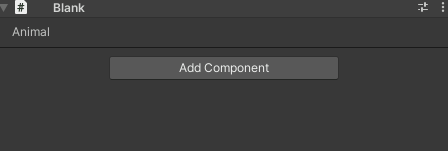

# 🦊 Outfoxeed Tools 🦊

This repository is a collection of tools and pre-made scripts imported or made for this repository for Unity:

- Tools enhancing Unity's interface and increase the speed of common manipulations: 
  - [Hierarchy Outliner](#-importing)
  - [Data Editor Window](#-data-editor-window)
  - [Toolbar buttons](#-toolbar-buttons)
  - [SerializeReference ContextualMenu](#-serializereference-contextualmenu)
- A collection of pre-made scripts to facilitate the creation of games:
  - [UI base](#-ui-base)
  - [Custom Attributes](#-custom-attributes)
  - GameManager base

---
## 🟠 IMPORTING
Import as a package in the Unity Package Manager with the git link 
(cf [link to it from github directly](https://docs.unity3d.com/Manual/upm-ui-giturl.html))
`https://github.com/outfoxeed/outfoxeed-tools.git`

---
## 🟠 TOOLS
### 🟡 Hierarchy Outliner
Tool overriding the drawing of the GameObjects in the hierarchy of Unity. 
Change the colors, alignment, font style and more depending on the name of the object, its components and its tags.

Easily configurable through an EditorWindow.

### 🟡 Data Editor Window
Editor Window able to query all ScriptableObjects of given types in the project to edit game's data more easily.
It is also able to delete and add ScriptableObjects of the same given types.

The types of ScriptableObjects to show and the path where to create new instances are easily editable in another EditorWindow openable from the 'Config' button in the DataEditorWindow.

### 🟡 Toolbar Buttons
Thanks to [Unity Toolbar Extender](https://github.com/marijnz/unity-toolbar-extender), we can easily add labels and buttons in the Unity toolbar. 
This package adds automatically one button for each scene in the build settings so you can switch of scene easily. 

### 🟡 SerializeReference ContextualMenu
Using SerializeReference fields we can Serialize in the Inspector an abstract class.
But we need more stuff to just create an instance of a concrete class and assign it to the property.

This package contains the ability to recognize SerializeReference fields and to give you the power to 
set the concrete type of the field instance by right clicking on it

---
## 🟠 PRE-MADE SCRIPTS
### 🟡 UI Base
UI Manager MonoBehaviour storing different pages of the UI by enums and handling the spawning and destruction of the UI menus

UIMenu script used by the UIManager representing a page in the ui and with operations as a page switch/leave
### 🟡 Custom Attributes
- ReadOnly attribute (makes a field non editable in the Unity inspector)
- Label attribute (changes the label of a field in the Unity inspector)

---
## 🟠 DEPENDENCIES
[Unity Toolbar Extender](https://github.com/marijnz/unity-toolbar-extender) by [Marijn *marijnz* Zwemmer](https://github.com/marijnz) 
--> Buttons in the toolbars are made using this repository (unity-toolbar-extender is a subtree of this repository)

---
## 🟠 FUTURE
TODO:
- Import package or add a dependency to a package serializing System.Type and remake HierarchyOutlinerConfigWindow and DataEditorConfigWindow with it.